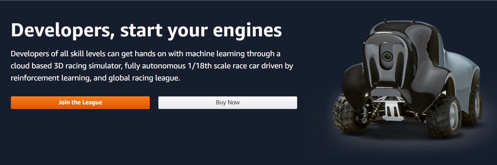

# AWS-DeepRacer
AWS Deepracer organised by ANZ Melbourne collaborated with Amazon to have a run for the go!!!

In this repo i will go through all my tries, though i lasted in **10th Position among 30 participants**


Though this wasn't exactly the competitions with the same parameters
* We cant change the **Actions** parameters
* We can't change the **Hyperparameters**


The Track used was of **[Re-Invent2018](https://github.com/aws-samples/aws-deepracer-workshops/tree/master/Workshops/2018-reInvent/Lab1)**

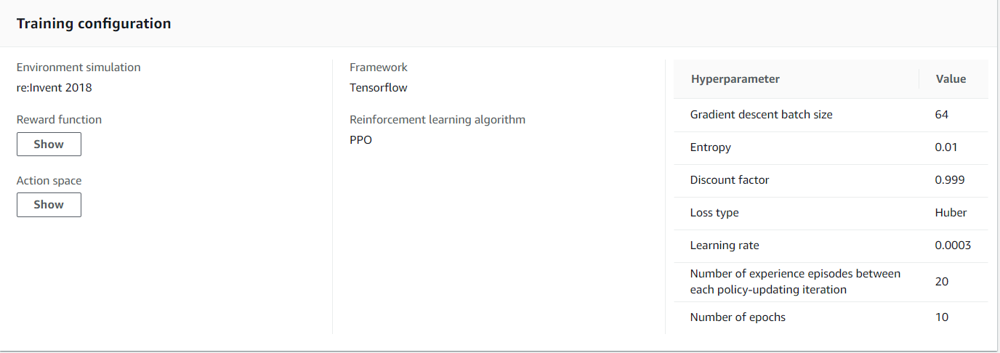

## Try 1
### Reward Function
```python
def straight_line_reward(current_reward, steering):
    # Positive reward if the car is in a straight line going fast
    if abs(steering) < 0.1:
        current_reward *= 1.5
    elif abs(steering) < 0.2:
        current_reward *= 1.2
    elif steering > 15:
        current_reward *= 0.8
    elif steering > 30:
        current_reward *= 0.5
        
    return current_reward
def direction_reward(reward, waypoints, closest_waypoints, heading):
    import math
    DIRECTION_THRESHOLD = 10
    next_point = waypoints[closest_waypoints[1]]
    prev_point = waypoints[closest_waypoints[0]]

    # Calculate the direction in radius, arctan2(dy, dx), the result is (-pi, pi) in radians
    direction = math.degrees(math.atan2(next_point[1] - prev_point[1], next_point[0] - prev_point[0]))

    # Cacluate difference between track direction and car heading angle
    direction_diff = abs(direction - heading)

    # Penalize if the difference is too large
    malus=1
    
    if direction_diff > DIRECTION_THRESHOLD:
        malus=1-(direction_diff/50)
        if malus<0 or malus>1:
            malus = 0
        reward *= malus
    
    return reward
    
import math

def reward_function(params):
    '''
    Use square root for center line
    '''
    track_width = params['track_width']
    distance_from_center = params['distance_from_center']
    steering = abs(params['steering_angle'])
    speed = params['speed']
    all_wheels_on_track = params['all_wheels_on_track']
    reward = 0.001
    if params['all_wheels_on_track']:
        reward = 1 - (distance_from_center / (track_width/2))**(4)
        if reward < 0:
            reward = 0.001
        reward = straight_line_reward(reward, steering)
        reward = direction_reward(reward, params['waypoints'], params['closest_waypoints'], params['heading'])
        reward *= (1+params['progress']/100)
            
    else:
        reward = 0.001

    return float(reward)

```
### Reward Function
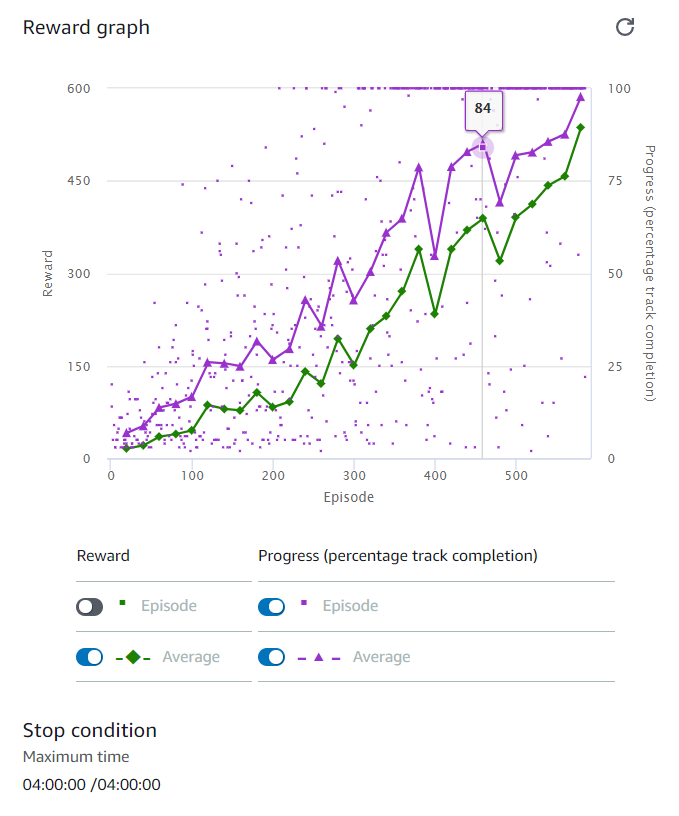
### Evaluation Results
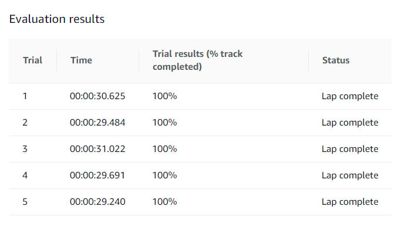


## Try 2
### Reward Function
```python
def steering_reward(reward, steering, is_left_of_center, speed):
    # For hard turn:
    if steering < -25 and is_left_of_center == False and speed < 3 or steering > 25 and is_left_of_center == True and speed < 3:
        reward *= 1.2
    else:
        reward *= 0.8

    # For soft turn
    if abs(steering) < 15 and speed < 4:
        reward *= 1.1
    else:
        reward *= 0.9

    # For straight
    if abs(steering) < 0.1 and speed > 4:
        reward *= 1.4

    return reward
    
def direction_reward(reward, waypoints, closest_waypoints, heading):
    import math
    next_point = waypoints[closest_waypoints[1]]
    prev_point = waypoints[closest_waypoints[0]]

    # Calculate the direction in radius, arctan2(dy, dx), the result is (-pi, pi) in radians
    direction = math.degrees(math.atan2(next_point[1] - prev_point[1], next_point[0] - prev_point[0]))

    # Cacluate difference between track direction and car heading angle
    direction_diff = abs(direction - heading)

    # Penalize if the difference is too large
    if direction_diff > 30:
        reward *= 0.5

    return reward

def reward_function1(params):

    if params['all_wheels_on_track']:
        reward = params['progress']/100
    else:
        reward = 0.001

    return float(reward)
    
def straight_line_reward(current_reward, steering, speed):
    # Positive reward if the car is in a straight line going fast
    if abs(steering) < 0.1 and speed > 6:
        current_reward *= 1.5
    elif abs(steering) < 0.2 and speed > 5:
        current_reward *= 1.2
    return current_reward

def reward_function(params):
    '''
    Example of rewarding the agent to follow center line
    '''
    # Give a very low reward by default
    reward = 1e-3
    # Read input parameters
    
    track_width = params['track_width']
    distance_from_center = params['distance_from_center']
    # Read input parameters
    all_wheels_on_track = params['all_wheels_on_track']
    
    steer = abs(params['steering_angle'])
    steer_thres = 12
    if all_wheels_on_track and (0.5*track_width - distance_from_center) >= 0.07:
        if steer > steer_thres:
            reward *= 0.8
        else:
            
            reward = 1.0
        reward = direction_reward(reward,params['waypoints'],params['closest_waypoints'],params['heading']) + reward
        reward = steering_reward(reward,steer,params['is_left_of_center'] , params['speed']) + reward
        reward += reward_function1(params)
        reward += straight_line_reward(reward, steer, params['speed'])
    else:
        reward = 1e-3
    
    return float(reward)

```
### Reward Function
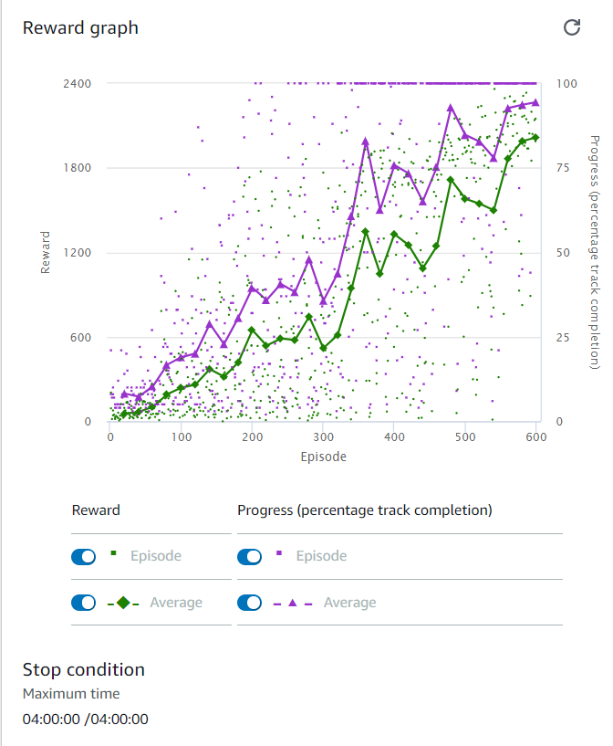
### Evaluation Results
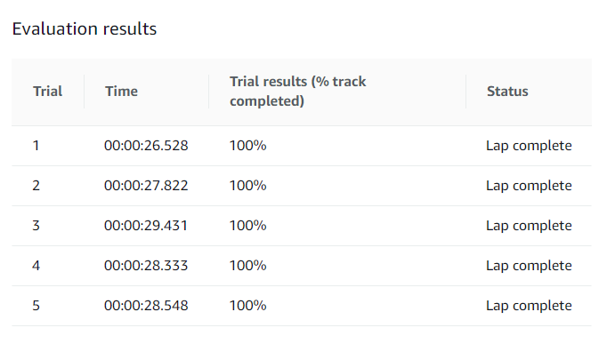


## Try 3
### Reward Function
```python
def straight_line_reward(current_reward, steering):
    # Positive reward if the car is in a straight line going fast
    if abs(steering) < 0.1:
        current_reward *= 1.5
    elif abs(steering) < 0.2:
        current_reward *= 1.2
    elif steering > 15:
        current_reward *= 0.8
    elif steering > 30:
        current_reward *= 0.5
        
    return current_reward
def direction_reward(reward, waypoints, closest_waypoints, heading):
    import math
    DIRECTION_THRESHOLD = 10
    next_point = waypoints[closest_waypoints[1]]
    prev_point = waypoints[closest_waypoints[0]]

    # Calculate the direction in radius, arctan2(dy, dx), the result is (-pi, pi) in radians
    direction = math.degrees(math.atan2(next_point[1] - prev_point[1], next_point[0] - prev_point[0]))

    # Cacluate difference between track direction and car heading angle
    direction_diff = abs(direction - heading)

    # Penalize if the difference is too large
    malus=1
    
    if direction_diff > DIRECTION_THRESHOLD:
        malus=1-(direction_diff/50)
        if malus<0 or malus>1:
            malus = 0
        reward *= malus
    
    return reward
    
import math

def reward_function(params):
    '''
    Use square root for center line
    '''
    track_width = params['track_width']
    distance_from_center = params['distance_from_center']
    steering = abs(params['steering_angle'])
    speed = params['speed']
    all_wheels_on_track = params['all_wheels_on_track']
    reward = 0.001
    if params['all_wheels_on_track']:
        reward = 1 - (distance_from_center / (track_width/2))**(4)
        if reward < 0:
            reward = 0.001
        reward = straight_line_reward(reward, steering)
        reward = direction_reward(reward, params['waypoints'], params['closest_waypoints'], params['heading'])
        reward *= (1+params['progress']/100)
            
    else:
        reward = 0.001

    return float(reward)

```
### Reward Function
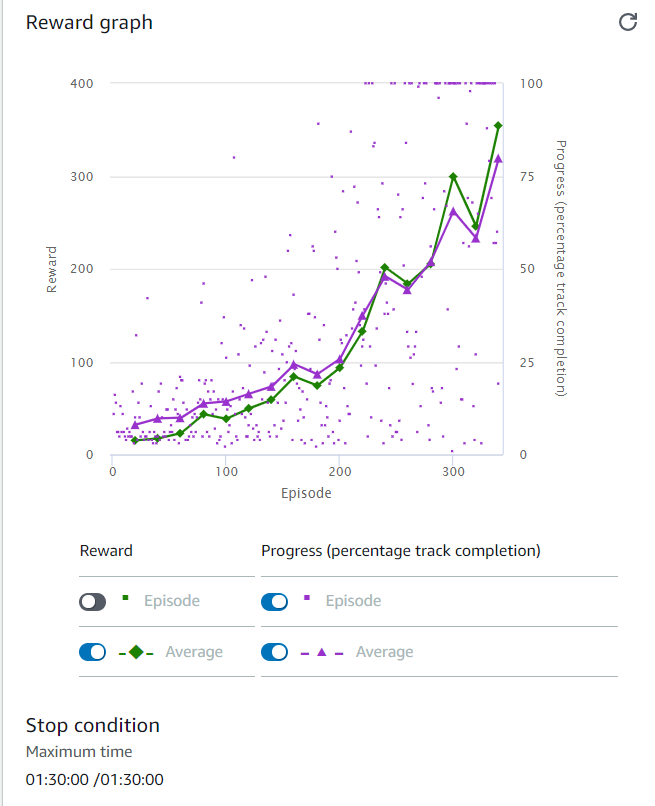
### Evaluation Results
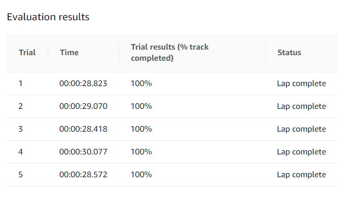


## Try 4
### Reward Function
```python
def steering_reward(reward, steering, is_left_of_center, speed):
    # For hard turn:
    if steering < -25 and is_left_of_center == False and speed < 3 or steering > 25 and is_left_of_center == True and speed < 3:
        reward *= 1.2
    else:
        reward *= 0.8

    # For soft turn
    if abs(steering) < 15 and speed < 4:
        reward *= 1.1
    else:
        reward *= 0.9

    # For straight
    if abs(steering) < 0.1 and speed > 4:
        reward *= 1.4

    return reward
    
def direction_reward(reward, waypoints, closest_waypoints, heading):
    import math
    next_point = waypoints[closest_waypoints[1]]
    prev_point = waypoints[closest_waypoints[0]]

    # Calculate the direction in radius, arctan2(dy, dx), the result is (-pi, pi) in radians
    direction = math.degrees(math.atan2(next_point[1] - prev_point[1], next_point[0] - prev_point[0]))

    # Cacluate difference between track direction and car heading angle
    direction_diff = abs(direction - heading)

    # Penalize if the difference is too large
    if direction_diff > 30:
        reward *= 0.5

    return reward

def reward_function1(params):

    if params['all_wheels_on_track']:
        reward = params['progress']/100
    else:
        reward = 0.001

    return float(reward)
    
def straight_line_reward(current_reward, steering, speed):
    # Positive reward if the car is in a straight line going fast
    if abs(steering) < 0.1 and speed > 6:
        current_reward *= 1.5
    elif abs(steering) < 0.2 and speed > 5:
        current_reward *= 1.2
    return current_reward

def reward_function(params):
    '''
    Example of rewarding the agent to follow center line
    '''
    # Give a very low reward by default
    reward = 1e-3
    # Read input parameters
    
    track_width = params['track_width']
    distance_from_center = params['distance_from_center']
    # Read input parameters
    all_wheels_on_track = params['all_wheels_on_track']
    
    steer = abs(params['steering_angle'])
    steer_thres = 12
    if all_wheels_on_track and (0.5*track_width - distance_from_center) >= 0.07:
        if steer > steer_thres:
            reward *= 0.8
        else:
            
            reward = 1.0
        reward = direction_reward(reward,params['waypoints'],params['closest_waypoints'],params['heading']) + reward
        reward = steering_reward(reward,steer,params['is_left_of_center'] , params['speed']) + reward
        reward += reward_function1(params)
        reward += straight_line_reward(reward, steer, params['speed'])
    else:
        reward = 1e-3
    
    return float(reward)

```
### Reward Function
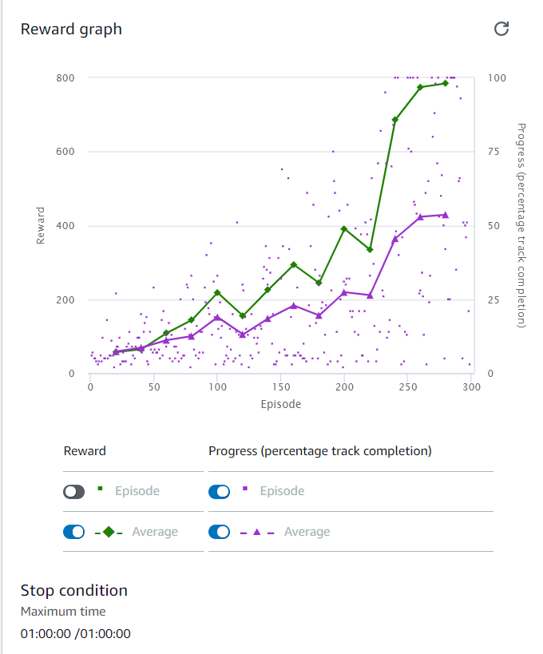
### Evaluation Results
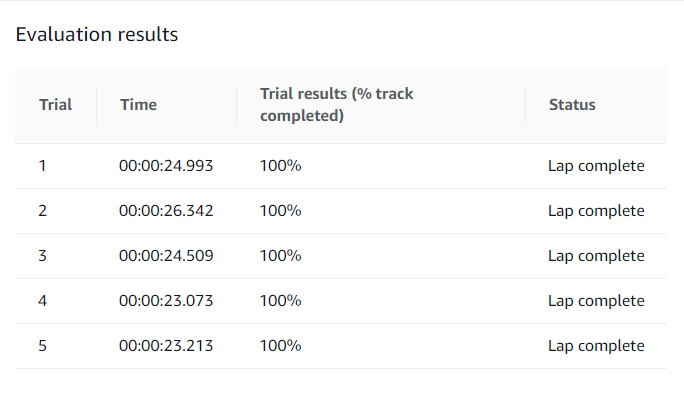


## Try 5
### Reward Function
```python
def steering_reward(reward, steering, is_left_of_center, speed):
    # For hard turn:
    if (steering < -25 and is_left_of_center == False) or (steering > 25 and is_left_of_center == True):
        reward *= 1.2
    else:
        reward *= 0.8

    # For soft turn
    if abs(steering) < 15 and speed < 4:
        reward *= 1.1
    else:
        reward *= 0.9

    # For straight
    if abs(steering) < 1 and speed > 4:
        reward *= 1.4

    return reward
    
def direction_reward(reward, waypoints, closest_waypoints, heading):
    import math
    next_point = waypoints[closest_waypoints[1]]
    prev_point = waypoints[closest_waypoints[0]]

    # Calculate the direction in radius, arctan2(dy, dx), the result is (-pi, pi) in radians
    direction = math.degrees(math.atan2(next_point[1] - prev_point[1], next_point[0] - prev_point[0]))

    # Cacluate difference between track direction and car heading angle
    direction_diff = abs(direction - heading)

    # Penalize if the difference is too large
    if direction_diff > 30:
        reward *= 0.5
    else:
        reward *= 1.1

    return reward

    
def straight_line_reward(current_reward, steering, speed):
    # Positive reward if the car is in a straight line going fast
    if abs(steering) < 0.1:
        current_reward *= 2
    elif abs(steering) < 0.3:
        current_reward *= 1.5
    elif abs(steering) < 0.5:
        current_reward *= 1.2
    return current_reward

def reward_function(params):
    '''
    Example of rewarding the agent to follow center line
    '''
    # Give a very low reward by default
    reward = 1e-3
    # Read input parameters
    
    track_width = params['track_width']
    distance_from_center = params['distance_from_center']
    # Read input parameters
    all_wheels_on_track = params['all_wheels_on_track']
    
    steer = abs(params['steering_angle'])
    steer_thres = 12
    if all_wheels_on_track and (0.5*track_width - distance_from_center) >= 0.05:
        if steer > steer_thres:
            reward = 0.8
        else:
            
            reward = 1.0
        reward = direction_reward(reward,params['waypoints'],params['closest_waypoints'],params['heading'])
        reward = steering_reward(reward,params['steering_angle'],params['is_left_of_center'] , params['speed'])
        reward = straight_line_reward(reward, params['steering_angle'], params['speed'])
    elif all_wheels_on_track and distance_from_center< track_width/4: 
        reward = steering_reward(reward,params['steering_angle'],params['is_left_of_center'] , params['speed'])
    else:
        reward = 1e-3
    
    return float(reward)

```
### Reward Function
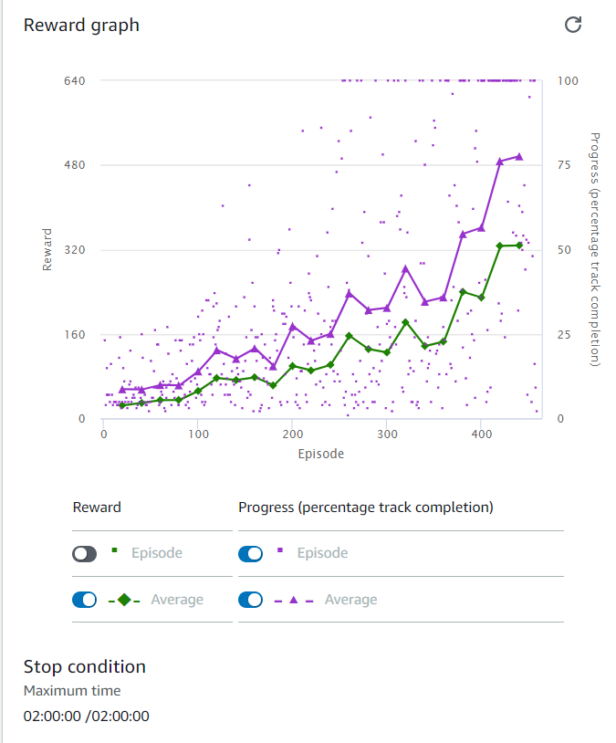
### Evaluation Results
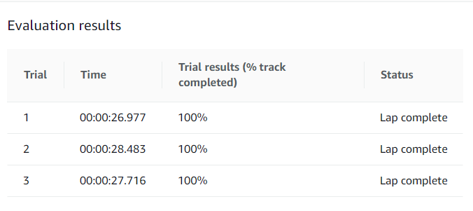

# Conclusion


